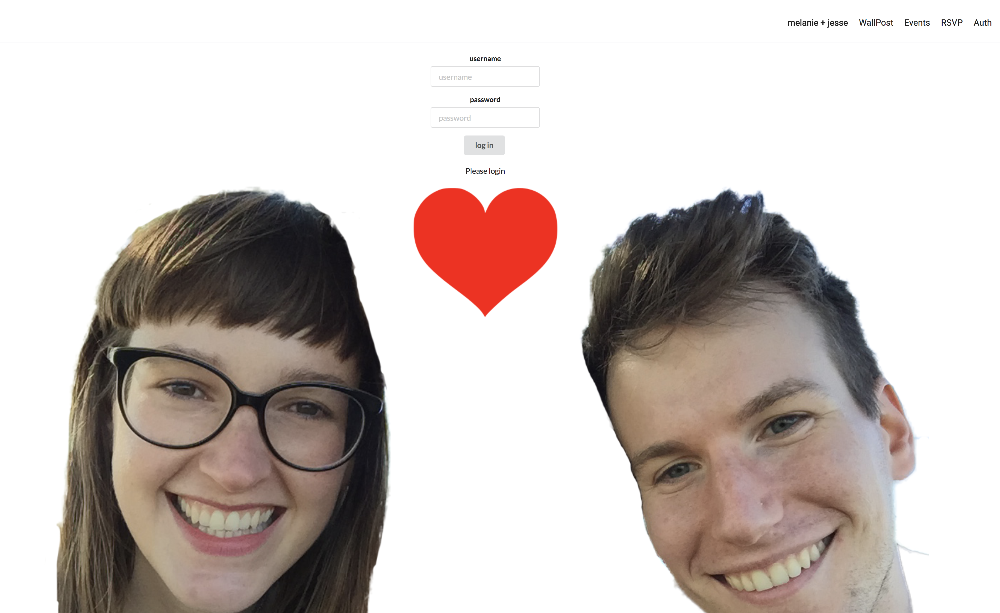

## FlatWedding - Frontend
FlatWedding is a React based wedding website with semantic ui. The goal is to have users login with a predetermined password (from invitations) that will give them access to a message board, schedule, registry information and an RSVP form.[Backend](https://github.com/SuperJesseH/FlatWeddingBackend)

## Build status
This is a work in progress (with a hard deadline!) check back for updates. Currently RSVP creates a new user, this will be refactored to an update user form.

## Screenshots

## Installation

<code>git clone THIS_URL</code>
<code>cd flat-wedding</code>
<code>npm install</code>
<code>npm start</code>

## Credits
Built by
[Jesse Horwitz](https://github.com/SuperJesseH), and [Celeste Gerard](https://github.com/celestegerard)
